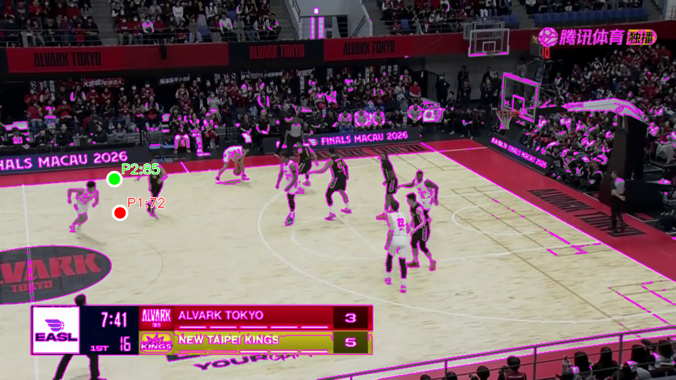
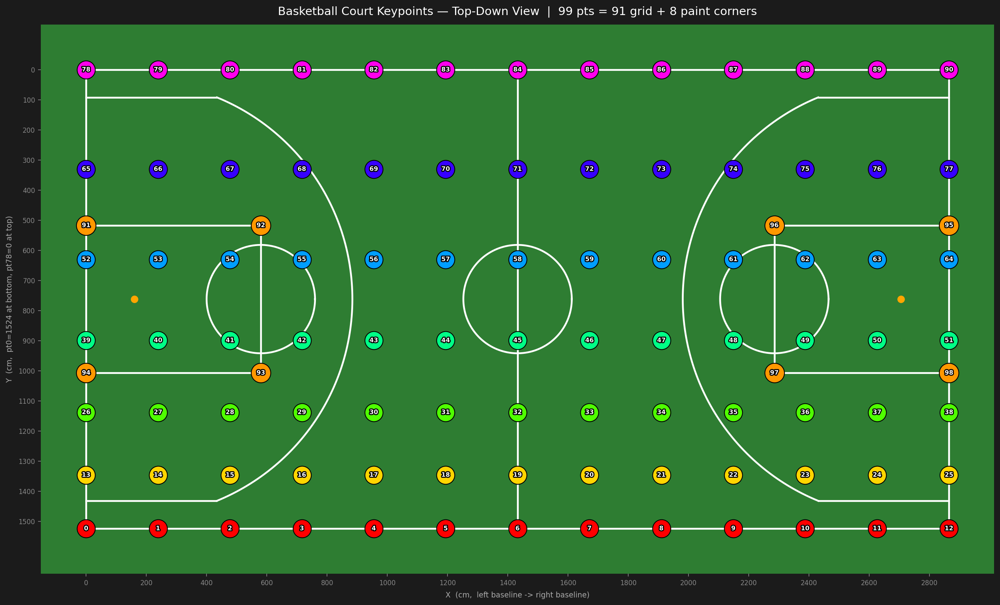

# Basketball Camera Calibration

基于 `2022-winners-camera-calibration-challenge` 中的 **KaliCalib** 方法，对篮球比赛图片和视频进行相机标定（单应矩阵估计 + 场地线可视化）。

---

## 目录结构

```text
basketball/
├── process_image.py                            # 单张图片推理脚本
├── process_image.sh                            # 示例调用脚本
├── heuristic.py                                # 启发式边线检测（RGB 原型 + SVM 决策边界）
├── process_video.py                            # 视频推理脚本（抽帧 + 汇总 JSON）
├── dino/                                       # ConvNeXt 升级模型（训练 + 定义）
│   ├── model_convnext.py                       #   KaliCalibConvNeXt 模型定义
│   ├── train.py                                #   微调训练脚本
│   ├── load_model.py                           #   backbone 下载辅助脚本
│   ├── checkpoints/                            #   训练产生的 checkpoint
│   ├── models/hub/                             #   timm 本地权重缓存
│   └── README.md                               #   dino 模块说明
├── 2022-winners-camera-calibration-challenge/  # KaliCalib 获胜方案（原始代码 + 模型）
│   ├── models/
│   │   ├── model_challenge.pth                 #   官方全量数据训练模型
│   │   └── model_test.pth                      #   官方 train-only 训练模型
│   ├── kalicalib/                              #   推理核心代码
│   └── configs/                               #   训练配置文件
├── camera-calibration-challenge/              # 官方 challenge 基线代码（参考）
├── images/                                    # 测试图片（image1.png … image5.png）
├── videos/                                    # 测试视频
├── results/                                   # 推理输出目录
├── keypoints_topdown.png                      # 91 个关键点俯视图（编号可视化）
├── visualize_keypoints_topdown.py             # 生成 keypoints_topdown.png 的脚本
└── requirements.txt                           # pip 依赖
```

---

## 环境准备

```bash
conda create -n task python=3.10
conda activate task
pip install -r requirements.txt
```

所有脚本均在 **`basketball/` 根目录**下运行。

---

## 模型下载

由于 github 的单文件限制，需要在 https://huggingface.co/Jinqi-T/Basketball-Calibration/resolve/main/model_tiny_final.pth 下载 tiny 权重，并保存为 ```dino/checkpoints/tiny_finetune/model_final.pth```。small 权重在 https://huggingface.co/Jinqi-T/Basketball-Calibration/resolve/main/model_small_final.pth ，但是实测效果不好，不建议使用。


## 单张图片推理 — `process_image.py`

### 快速开始
```bash
./process_image.sh
```

```bash 
python process_image.py images/image1.png \
  --output-dir results \
  --model dino/checkpoints/tiny_finetune/model_final.pth \
  --valid-model 2022-winners-camera-calibration-challenge/models/model_challenge.pth \
  --valid-diff-threshold 80 \
  --threshold 0.9 \
  --check 10 \
  --clahe --draw-keypoints --print-coords \
  --verbose
```

### 输出文件

每次推理在 `--output-dir` 目录下生成两个文件：

| 文件 | 说明 |
|------|------|
| `<image>_calibrated.png` | 标定可视化图（红色场地线 + 可选关键点叠加） |
| `<image>_result.json` | 完整结果 JSON（关键点坐标/置信度、单应矩阵、验证结果等） |

### 参数说明

| 参数 | 是否必填 | 默认值 | 说明 |
|------|----------|--------|------|
| `input` | ✅ | — | 输入图片路径 |
| `--output-dir` | ✅ | — | 输出目录 |
| `--model` | ✅ | — | 模型权重路径（`.pth`） |
| `--threshold` | — | `0.0` | 置信度阈值；低于该值的关键点不参与计算 |
| `--top-k` | — | 全部 | 阈值过滤后取置信度最高的 K 个点计算单应矩阵 |
| `--check` | — | — | 最少有效关键点数量；不足时输出原始图像并标记 `check_failed` |
| `--valid-model` | — | — | 验证模型路径；差异过大时输出原始图像并标记 `validation_failed` |
| `--valid-diff-threshold` | — | `20.0` | 两模型关键点平均像素距离上限（px） |
| `--clahe` | — | — | 开启 CLAHE 预处理（LAB 色彩空间 L 通道均衡化，改善光照差异） |
| `--draw-keypoints` | — | — | 在输出图上叠加 91 个关键点并标注编号 |
| `--print-coords` | — | — | 配合 `--draw-keypoints` + `--verbose`，将坐标打印到终端 |
| `--verbose` | — | — | 打印进度信息；默认完全静默 |

### 示例

```bash
# 基础推理（静默）
python process_image.py images/image1.png \
  --output-dir results \
  --model 2022-winners-camera-calibration-challenge/models/model_challenge.pth

# 开启详细输出 + 关键点可视化
python process_image.py images/image1.png \
  --output-dir results \
  --model 2022-winners-camera-calibration-challenge/models/model_challenge.pth \
  --draw-keypoints --print-coords --verbose

# 置信度过滤 + top-k + CLAHE
python process_image.py images/image1.png \
  --output-dir results \
  --model 2022-winners-camera-calibration-challenge/models/model_challenge.pth \
  --threshold 0.5 --top-k 30 --clahe --verbose

# 使用 dino 微调模型 + 最少关键点检查
python process_image.py images/image1.png \
  --output-dir results \
  --model dino/checkpoints/tiny_finetune/model_500.pth \
  --threshold 0.9 --check 10 --verbose

# 双模型交叉验证（平均偏差 > 80 px 则输出原始图像）
python process_image.py images/image1.png \
  --output-dir results \
  --model dino/checkpoints/tiny_finetune/model_final.pth \
  --valid-model 2022-winners-camera-calibration-challenge/models/model_challenge.pth \
  --valid-diff-threshold 80 \
  --threshold 0.9 --check 10 --clahe --draw-keypoints --print-coords --verbose
```

### `_result.json` 结构

```json
{
  "timestamp": "2026-06-10T14:32:00",
  "input": "/abs/path/to/image1.png",
  "output_dir": "/abs/path/to/results",
  "settings": {
    "model": "...", "threshold": 0.9, "top_k": null,
    "check": 10, "clahe": true, "valid_diff_threshold": 80.0
  },
  "status": "success",
  "model_arch": "convnext_tiny.dinov3_lvd1689m",
  "homography": [[...], [...], [...]],
  "keypoints": {
    "0":  {"img_x": 123.4, "img_y": 456.7, "conf": 0.023456},
    "13": {"img_x": 200.1, "img_y": 300.5, "conf": 0.987654},
    "...": {}
  },
  "valid_model_arch": "resnet18 (original)",
  "valid_keypoints": {"...": {}},
  "check_result":      {"valid_count": 15, "required": 10, "passed": true},
  "validation_result": {"ok": true, "mean_dist_px": 5.2, "max_dist_px": 12.1,
                        "n_common": 45, "n_main": 60, "n_valid": 58}
}
```

`status` 取值：`"success"` / `"check_failed"` / `"validation_failed"` / `"insufficient_points"`

### 启发式边线检测 — `heuristic.py`

在 `process_image.py` 输出的关键点基础上，**不依赖场地几何模型**，通过颜色启发式自动估计场地边线。脚本读取原图与 `_result.json`，在 RGB 空间中训练软间隔线性 SVM，并绘制决策边界（`decision = 0` 的等高线）。

#### 算法流程

```
_result.json 关键点
        │
        ▼
┌───────────────────────────────────────────────────────────┐
│ 阶段 1：地板颜色原型（class0）                              │
│   从场地内侧关键点集合中，取各点像素 RGB                     │
│   迭代剔除与当前均值欧式距离最远的点，直至剩 1 个 → P1       │
└───────────────────────────┬───────────────────────────────┘
                            │ P1 的 RGB
                            ▼
┌───────────────────────────────────────────────────────────┐
│ 阶段 2：边线颜色原型（class1）                              │
│   从边线附近关键点集合中，以 P1 为中心取 pixel×pixel 正方形  │
│   保留与 P1 RGB 距离 > threshold 的像素，求均值 → value     │
│   对各关键点的 value 重复阶段 1 的迭代剔除 → P2             │
└───────────────────────────┬───────────────────────────────┘
                            │ class0 = P1 RGB, class1 = P2 value
                            ▼
┌───────────────────────────────────────────────────────────┐
│ 阶段 3：全图 SVM 分类                                       │
│   每个像素按距 class0 / class1 的 RGB 欧式距离打伪标签       │
│   在 RGB 空间训练软间隔线性 SVM（LinearSVC）                │
│   提取 decision=0 等高线作为边线决策边界                     │
└───────────────────────────────────────────────────────────┘
```

**阶段 1 关键点**（地板区域，共 45 个）：
`66–76, 55–57, 59–61, 42–44, 46–48, 27–37, 14–24`（JSON 中未识别到的自动跳过）

**阶段 2 关键点**（边线附近，共 36 个）：
`78–90, 77, 64, 51, 38, 25, 12–0, 13, 26, 39, 52, 65`

#### 输出示意

下图以 `image5` 为例：红色圆点 **P1** 为阶段 1 选中的地板原型点，绿色圆点 **P2** 为阶段 2 选中的边线原型点，紫色细线为 SVM 决策边界。



#### 快速开始

需先运行 `process_image.py` 生成对应的 `_result.json`：

```bash
python heuristic.py \
  --image images/image5 \
  --result-json results/image5_result.json \
  --verbose
```

#### 输出文件

| 文件 | 说明 |
|------|------|
| `<image>_rgb_svm_boundary.png` | 原图叠加 P1、P2 标记与 SVM 决策边界 |

#### 参数说明

| 参数 | 是否必填 | 默认值 | 说明 |
|------|----------|--------|------|
| `--image` | — | `images/image5` | 输入图像路径（可省略扩展名，自动尝试 `.png`/`.jpg`） |
| `--result-json` | — | `results/image5_result.json` | `process_image.py` 输出的关键点 JSON |
| `--pixel` | — | `40` | 阶段 2 正方形边长（像素） |
| `--threshold` | — | `40.0` | 正方形内像素与 P1 RGB 的距离阈值；仅保留距离 **大于** 该值的像素参与 value 计算 |
| `--C` | — | `1.0` | 软间隔 SVM 惩罚系数 |
| `--no-contours` | — | — | 不绘制决策边界，仅保留 P1/P2 标记 |
| `--output` | — | `results/<image>_rgb_svm_boundary.png` | 自定义输出路径 |
| `--verbose` | — | — | 打印运行详情；默认完全静默 |

#### 示例

```bash
# 静默运行（默认 image5）
python heuristic.py

# 指定其他图片
python heuristic.py \
  --image images/image1 \
  --result-json results/image1_result.json \
  --verbose

# 调整正方形大小与颜色阈值
python heuristic.py \
  --image images/image3.png \
  --result-json results/image3_result.json \
  --pixel 40 --threshold 50 --verbose
```

---

## 视频推理 — `process_video.py`

对视频执行**逐帧（或抽帧）**推理，输出叠加了场地线的标定视频和逐帧汇总 JSON。

### 快速开始
```bash
./process_video.sh
```

```bash
python process_video.py videos/video1.mp4 \
  --output-dir results \
  --model dino/checkpoints/tiny_finetune/model_final.pth \
  --valid-model 2022-winners-camera-calibration-challenge/models/model_challenge.pth \
  --valid-diff-threshold 80 \
  --threshold 0.9 \
  --check 10 \
  --frame-step 1 \
  --clahe \
  --verbose
```

### 抽帧逻辑

- **关键帧**（`frame_idx % frame_step == 0`）：执行完整推理流程，更新单应矩阵缓存。
- **中间帧**（仅在 `frame_step > 1` 时存在）：复用上一次成功的单应矩阵重绘场地线，保持视觉连贯，**不写入 JSON**。

### 输出文件

| 文件 | 说明 |
|------|------|
| `<stem>_calibrated.mp4` | 完整视频（所有帧都写入，中间帧复用上次叠加） |
| `<stem>_results.json` | 被推理的关键帧结果列表（每条含 `frame_idx`） |

### 参数说明

| 参数 | 是否必填 | 默认值 | 说明 |
|------|----------|--------|------|
| `video` | ✅ | — | 输入视频路径 |
| `--output-dir` | ✅ | — | 输出目录 |
| `--model` | ✅ | — | 模型权重路径（`.pth`） |
| `--frame-step` | — | `1` | 每隔 N 帧推理一次（`1` = 每帧都推理） |
| `--threshold` | — | `0.0` | 置信度阈值 |
| `--top-k` | — | 全部 | 取置信度最高的 K 个点计算单应矩阵 |
| `--check` | — | — | 最少有效关键点数量；不足时该帧标记为 `check_failed` |
| `--clahe` | — | — | 开启 CLAHE 预处理 |
| `--valid-model` | — | — | 验证模型路径 |
| `--valid-diff-threshold` | — | `20.0` | 两模型关键点平均像素距离上限（px） |
| `--verbose` | — | — | 打印进度信息 |

### 示例

```bash
# 每帧推理（默认）
python process_video.py videos/game.mp4 \
  --output-dir results \
  --model 2022-winners-camera-calibration-challenge/models/model_challenge.pth \
  --verbose

# 每 10 帧推理一次，中间帧复用
python process_video.py videos/game.mp4 \
  --output-dir results \
  --model dino/checkpoints/tiny_finetune/model_final.pth \
  --frame-step 10 \
  --threshold 0.9 --check 10 --clahe --verbose

# 双模型验证 + 抽帧
python process_video.py videos/game.mp4 \
  --output-dir results \
  --model dino/checkpoints/tiny_finetune/model_final.pth \
  --valid-model 2022-winners-camera-calibration-challenge/models/model_challenge.pth \
  --valid-diff-threshold 80 \
  --frame-step 5 --threshold 0.9 --check 10 --clahe --verbose
```

### `_results.json` 结构

视频 JSON 是一个列表，每个元素对应一个被推理的关键帧，字段与 `_result.json` 一致，额外含 `frame_idx`：

```json
[
  {
    "frame_idx": 0,
    "status": "success",
    "model_arch": "convnext_tiny.dinov3_lvd1689m",
    "homography": [[...], [...], [...]],
    "keypoints": {"0": {"img_x": 123.4, "img_y": 456.7, "conf": 0.98}, "...": {}},
    "valid_model_arch": null,
    "valid_keypoints": null,
    "check_result": {"valid_count": 23, "required": 10, "passed": true},
    "validation_result": null
  },
  {
    "frame_idx": 10,
    "status": "check_failed",
    "homography": null,
    "keypoints": {"...": {}},
    "check_result": {"valid_count": 3, "required": 10, "passed": false},
    "...": {}
  }
]
```

`status` 取值同 `process_image.py`：`"success"` / `"check_failed"` / `"validation_failed"` / `"insufficient_points"`

---

## 训练新模型 — `dino/train.py`

使用 **ConvNeXt（DINOv3 预训练）+ U-Net 解码器** 微调篮球场关键点检测模型，输出与原始 KaliCalib 格式完全兼容的 checkpoint。

### 模型架构

```
输入 (B, 3, 540, 960)
        │
┌───────┴──────────────────┐
│  ConvNeXt Backbone        │  DINOv3 (LVD-1689M) 预训练
│  f0: H/4  × W/4  × C96   │
│  f1: H/8  × W/8  × C192  │
│  f2: H/16 × W/16 × C384  │
│  f3: H/32 × W/32 × C768  │
└───────┬──────────────────┘
        │  skip connections (U-Net)
┌───────┴──────────────────┐
│  U-Net Decoder (3 stage)  │
│  1×1 Conv head            │
└───────┬──────────────────┘
        │
输出 (B, 94, 135, 240)  ← 与原始 ResNet-18 输出格式完全一致
```

### 参数说明

| 参数 | 是否必填 | 默认值 | 说明 |
|------|----------|--------|------|
| `--checkpoint-dir` | ✅ | — | checkpoint 保存目录（如 `dino/checkpoints/exp1`） |
| `--arch` | — | `convnext_tiny.dinov3_lvd1689m` | 模型架构（tiny / small） |
| `--epochs` | — | `500` | 总训练轮数 |
| `--lr` | — | `1e-4` | 初始学习率（AdamW） |
| `--batch-size` | — | 配置文件值 | 覆盖配置文件的 batch size |
| `--freeze-backbone-epochs` | — | `0` | 前 N epoch 冻结 backbone；0 表示全程微调 |
| `--save-every` | — | `10` | 每隔 N epoch 保存一次 |
| `--resume` | — | — | 从指定 checkpoint 继续训练 |
| `--config-file` | — | `train_sviewds_full_dataset.yml` | 数据集配置文件（默认与 `model_challenge.pth` 训练条件一致） |

### 示例

```bash
# 基础微调（全程训练 backbone）
python dino/train.py \
  --checkpoint-dir dino/checkpoints/tiny_full \
  --epochs 500

# 推荐：两阶段训练（先冻结 backbone 50 epoch，再解冻）
python dino/train.py \
  --checkpoint-dir dino/checkpoints/tiny_finetune \
  --epochs 500 \
  --freeze-backbone-epochs 50 \
  --lr 1e-4

# 使用 ConvNeXt-Small（精度更高）
python dino/train.py \
  --arch convnext_small.dinov3_lvd1689m \
  --checkpoint-dir dino/checkpoints/small_finetune \
  --epochs 500 --freeze-backbone-epochs 50

# 断点续训
python dino/train.py \
  --checkpoint-dir dino/checkpoints/tiny_finetune \
  --resume dino/checkpoints/tiny_finetune/model_200.pth \
  --epochs 500
```

### Checkpoint 格式

```python
{
    'arch':       'convnext_tiny.dinov3_lvd1689m',
    'state_dict': { ... },
    'epoch':      500,
    'loss':       0.00012345,
}
```

`process_image.py` / `process_video.py` 通过检测 `'arch'` 键自动识别新旧格式，无需手动配置。

---

## 可用模型

| 模型文件 | 架构 | 预训练 | 说明 |
|----------|------|--------|------|
| `2022-winners-camera-calibration-challenge/models/model_challenge.pth` | ResNet-18 | ImageNet-1K | 官方全量数据训练，MSE 73.16 mm |
| `2022-winners-camera-calibration-challenge/models/model_test.pth` | ResNet-18 | ImageNet-1K | 官方 train-only，MSE 107.78 mm |
| `dino/checkpoints/<exp>/model_<epoch>.pth` | ConvNeXt-Tiny/Small | DINOv3 LVD-1689M | 自训练微调模型 |

| 模型 | 参数量 | 推理速度（960×540, GPU） | 跨场馆泛化 |
|------|--------|--------------------------|------------|
| ResNet-18（原始） | ~14M | ~80 fps | 一般 |
| ConvNeXt-Tiny | ~35M | ~50 fps | 较好 |
| ConvNeXt-Small | ~57M | ~35 fps | 最好 |

---

## 关键点编号

模型检测 `0`–`90` 共 91 个地面关键点，按 **7 行 × 13 列**排列，编号规则：

```
index = 13 × row + col
```

行 0 为底线（最靠近左下角），列 0 为左侧边线。详见 `keypoints_topdown.png`。


